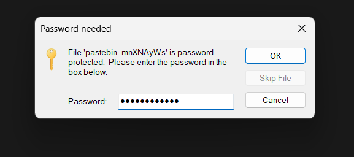
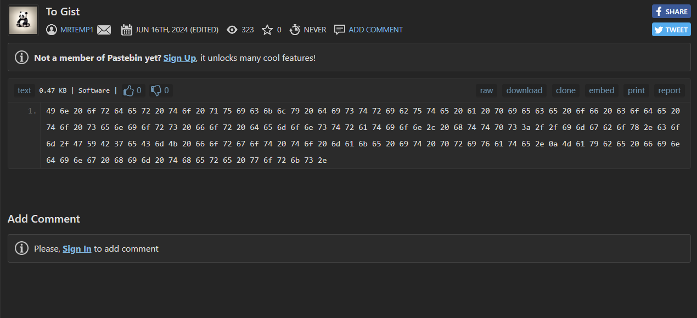
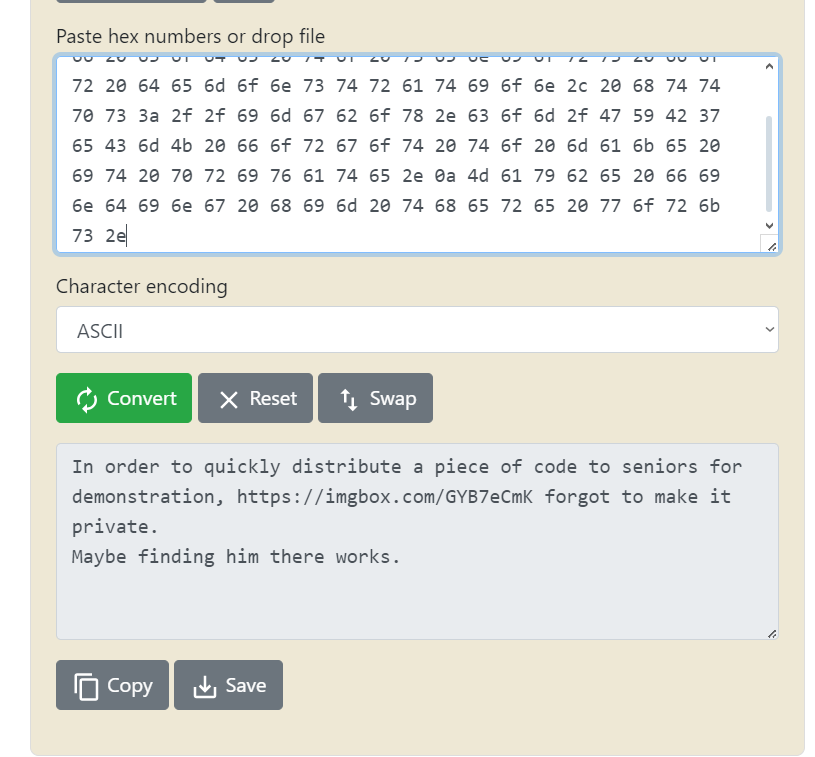
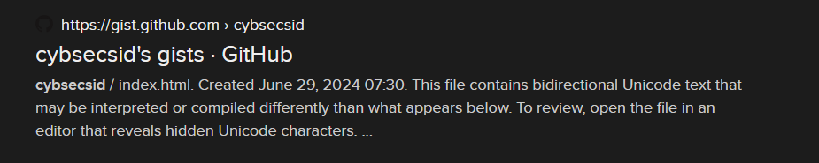
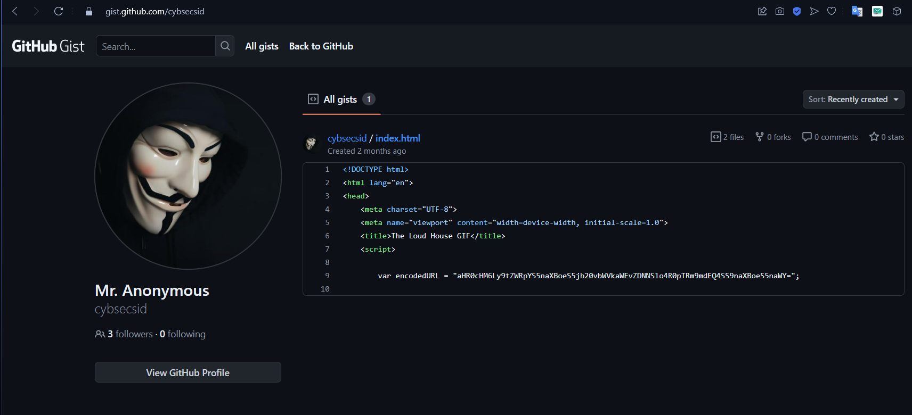
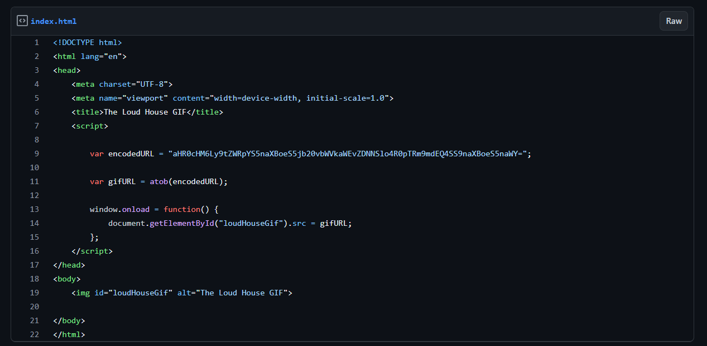
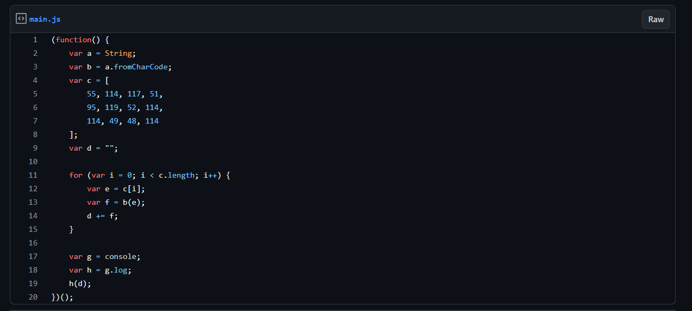
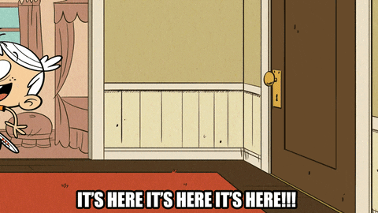
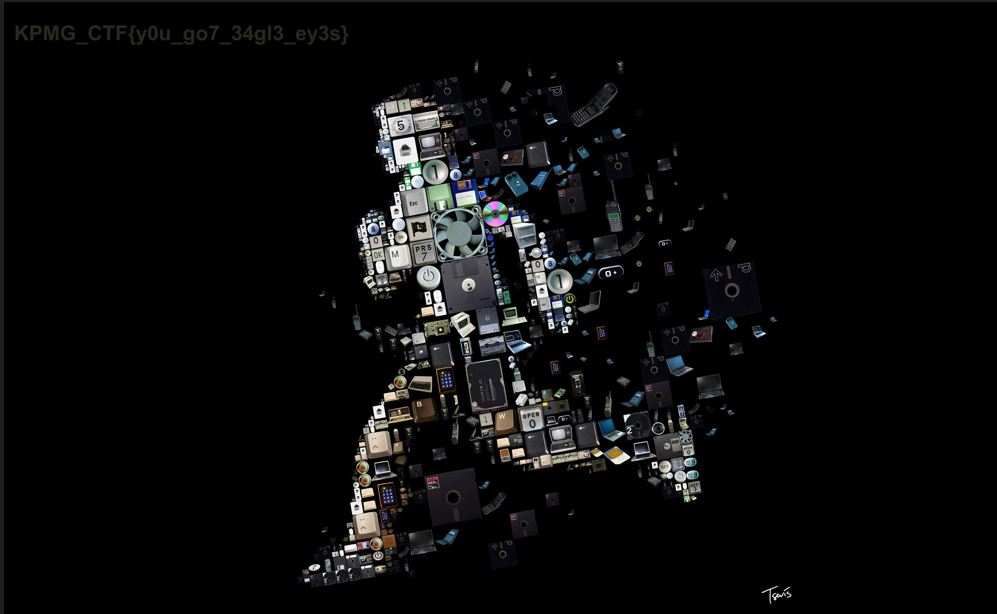

# The Code Trail - 400

1. first we got a file named [pastebin_mnXNAyWs](https://pastebin.com/mnXNAyWs) which is password protected and contain jpg

    

1. Then it is suspicious that pastebin is used here then we go to site pastebin.com/mnXNAyWs
2. we got this page at <https://pastebin.com/mnXNAyWs>

    

    ```markdown
    49 6e 20 6f 72 64 65 72 20 74 6f 20 71 75 69 63 6b 6c 79 20 64 69 73 74 72 69 62 75 74 65 20 61 20 70 69 65 63 65 20 6f 66 20 63 6f 64 65 20 74 6f 20 73 65 6e 69 6f 72 73 20 66 6f 72 20 64 65 6d 6f 6e 73 74 72 61 74 69 6f 6e 2c 20 68 74 74 70 73 3a 2f 2f 69 6d 67 62 6f 78 2e 63 6f 6d 2f 47 59 42 37 65 43 6d 4b 20 66 6f 72 67 6f 74 20 74 6f 20 6d 61 6b 65 20 69 74 20 70 72 69 76 61 74 65 2e 0a 4d 61 79 62 65 20 66 69 6e 64 69 6e 67 20 68 69 6d 20 74 68 65 72 65 20 77 6f 72 6b 73 2e
    ```

3. Then after decoding the hex code given we got

    

    ```markdown
    In order to quickly distribute a piece of code to seniors for demonstration, https://imgbox.com/GYB7eCmK forgot to make it private.
    Maybe finding him there works.
    ```

4. This is the link we got [https://imgbox.com/GYB7eCmK](https://imgbox.com/GYB7eCmK)

    after looking into the link the image were there in it -

    

5. then we searched cybsecsid on duckduckgo we got some github links -

    

    

    there is gists in the starting step

6. got some code in it

    

    

    

    ```markdown
    (function() {
        var a = String;
        var b = a.fromCharCode;
        var c = [
            55, 114, 117, 51,
            95, 119, 52, 114,
            114, 49, 48, 114
        ];
        var d = "";
        
        for (var i = 0; i < c.length; i++) {
            var e = c[i];
            var f = b(e);
            d += f;
        }
        
        var g = console;
        var h = g.log;
        h(d);
    })();
    ```

    answer was - 7ru3_w4rr10r  (js output)

    

7. this is password of given file

    

    

    heyyyyy its flag is here  - KPMG_CTF{y0u_go7_34gl3_ey3s}
  