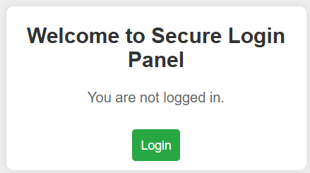
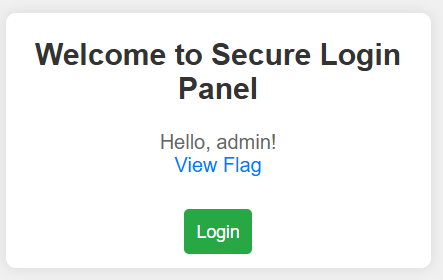

# Memorandum Dissolve 5 - 100

*I love biscuits, chocolates and …….. ?*

- **Login Page:**
On opening the challenge, we are greeted by a login page.

    

- **Inspecting the Page:**
Inspecting the page, we find a comment: `<!-- test:password123 -->`.
- **Logging In:**
Using the credentials from the comment (`test:password123`), we can log in, which redirects us to `index.php`.
- **Hint - Cookies:**
The problem statement hints that the blank could be related to cookies. Checking the cookies, we find two cookies named `PHPSESSID` and `session`. Interestingly, the `session` cookie didn't change after multiple logins, which raised some curiosity.

    The `session` cookie value was `098f6bcd4621d373cade4e832627b4f6`.

- **Analyzing the Cookie:**
Heading over to [Dcode.fr](http://dcode.fr/) and using the cipher identifier, two possibilities were suggested: ASCII and MD5. Decoding the cookie using MD5 revealed that the value was `test`, indicating that the `session` cookie was just the MD5 hash of the username.
- **Exploiting the Cookie:**
I then MD5 hashed the word `admin`, which resulted in `21232f297a57a5a743894a0e4a801fc3`.

    Changing the `session` cookie to this value in `index.php`, we could see the flag.

    

- **Note:**
The flag changes with every machine deployed.
