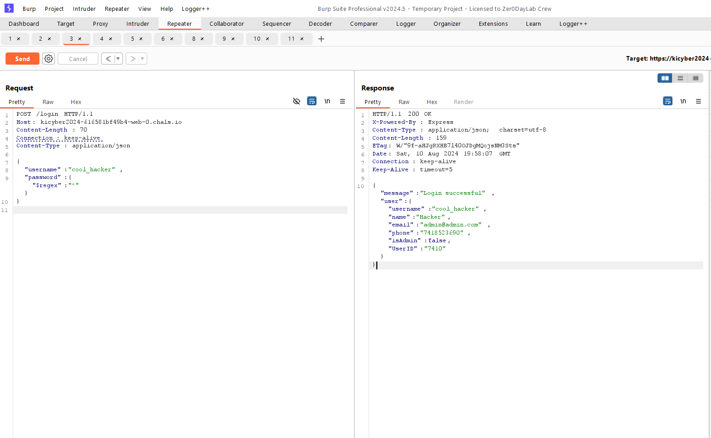
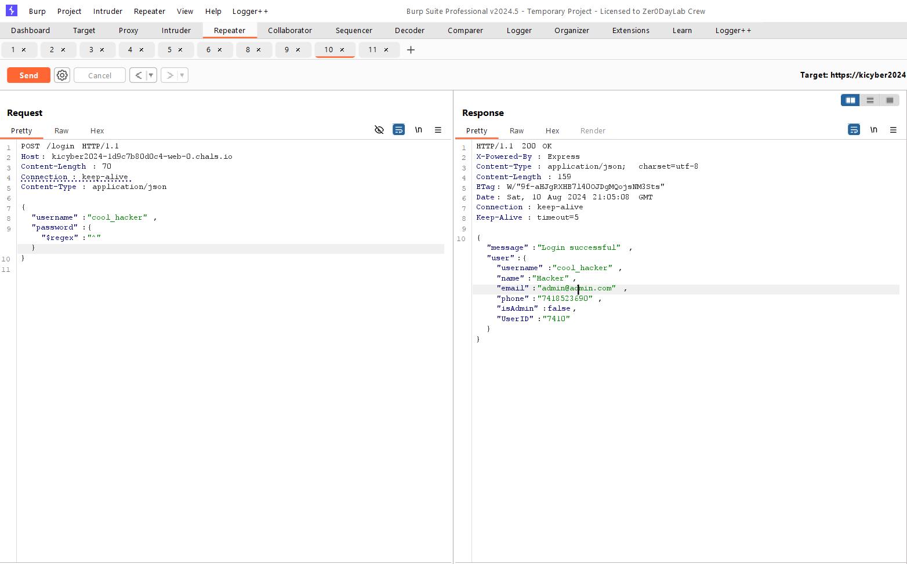
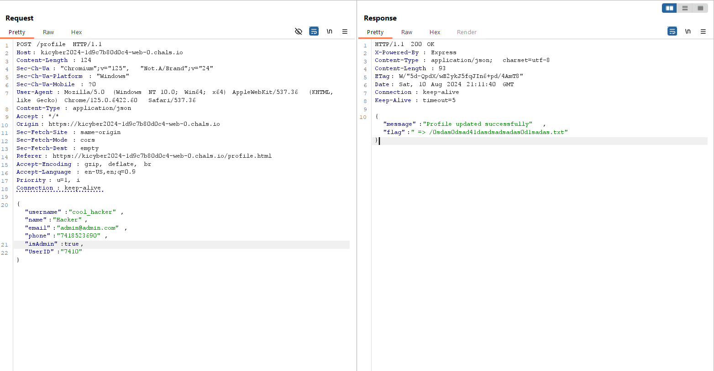

# Not a BruteForce One - 200

- Inspect the source code and there we get to know about profile.html endpoint.

    take a note of this endpoint.

- enter random credentials in login page to get the packet parameters.
- enter regex password as shown in image

- you will now get the details of the user.
- Now copy the userID and change the isAdmin to true

- now the flag will seen on this endpoint.

