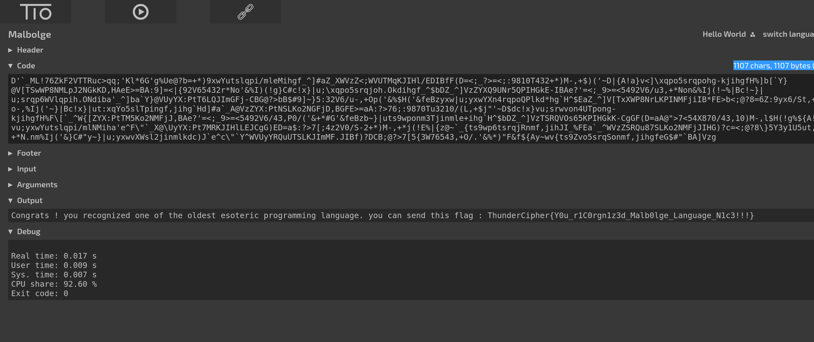

# Ben Olmstead

100

It's very hard to learn but you can.

https://drive.google.com/open?id=1w8R0N3CMGj9f3kENcT9-cafqqyL9HLhj

Flag Format: ThunderCipher{a-zA-Z0-9}

Author: p4nth3r

## Solution

1. the content of the file looks like esoteric language, so google search Ben Olmstead (He made Malbolge language)
2. Use the online tryitonline tool, it is good for esoteric languages

