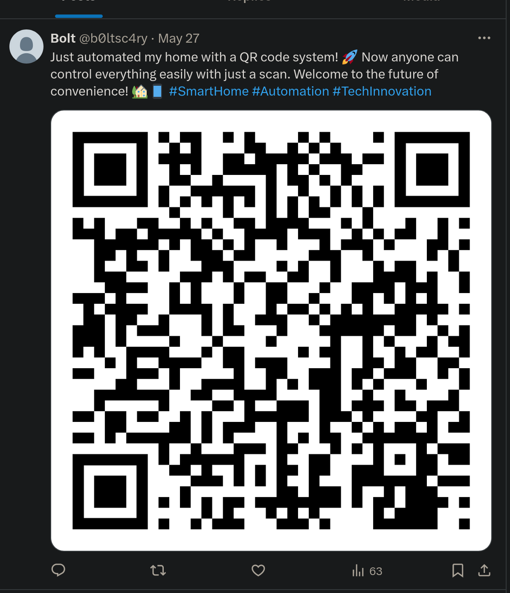

# Scared

100

It was a cold, rainy evening when cybersecurity analyst Alex received a mysterious message. The subject line read: "Can you find me?" Intrigued, Alex opened the email to find a single clue: a username- sc4ryb0lt.

Flag Format: ThunderCipher{a-zA-Z0-9}

Author: p4nth3r

## Solution

1. https://instantusername.com/?q=sc4ryb0lt check github its present

    

2. check portfolio repos index.html it has a twitter profile 

    

3. FLag in qr

    

    
