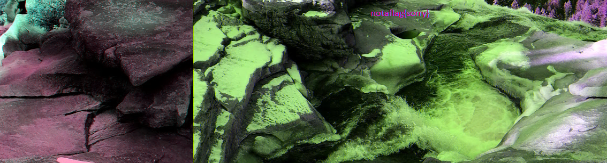
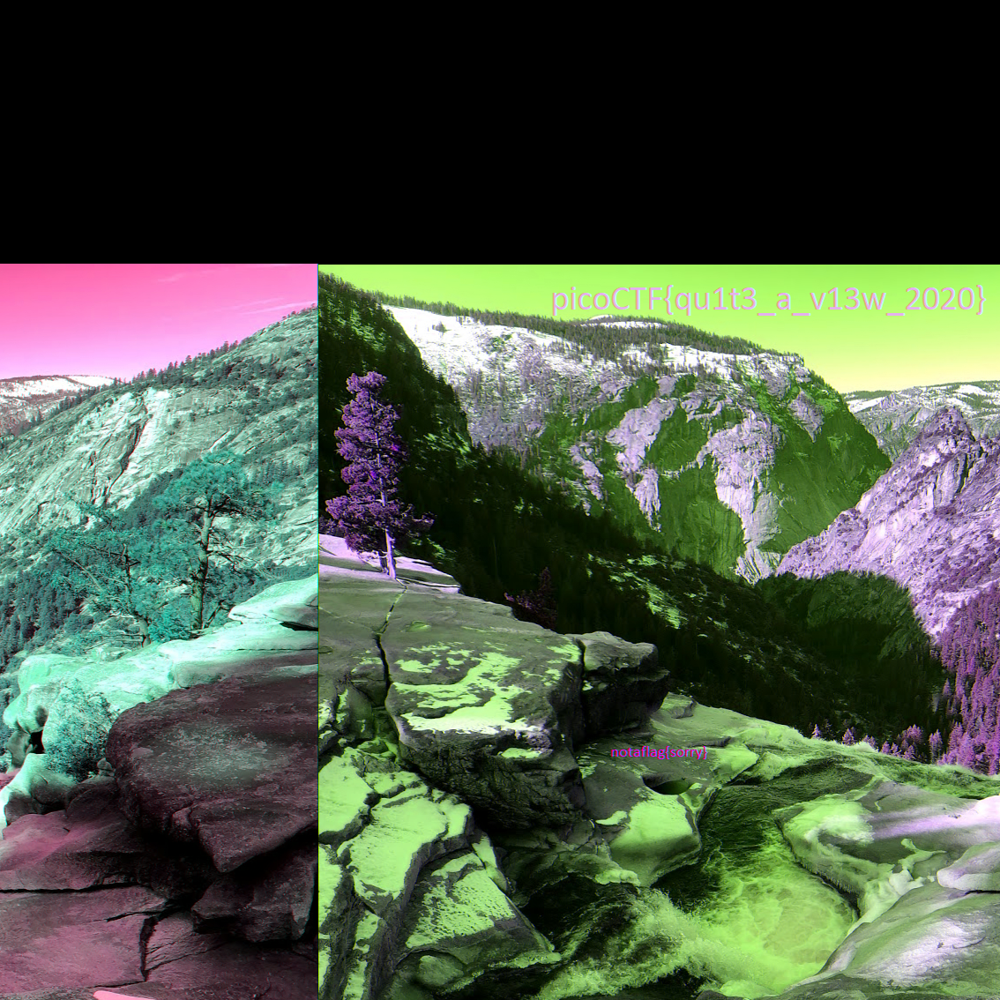

# tunn3l v1s10n
We found this file. Recover the flag.
Hint: Weird that it won't display right...

# Solution
1. Check with hexdump, magic number matches to BMP `42 4d`
2. try to open with any image editor, it opens the image but is not clear, or looks like half cut

3. So this images height needs to be fixed, https://en.wikipedia.org/wiki/BMP_file_format#Example_1 has a table of offsets info. I need to change `32 01` (Height) at offset 16 to be same as `6e 04` (Width) inorder to get square image.
4. Flag !!
